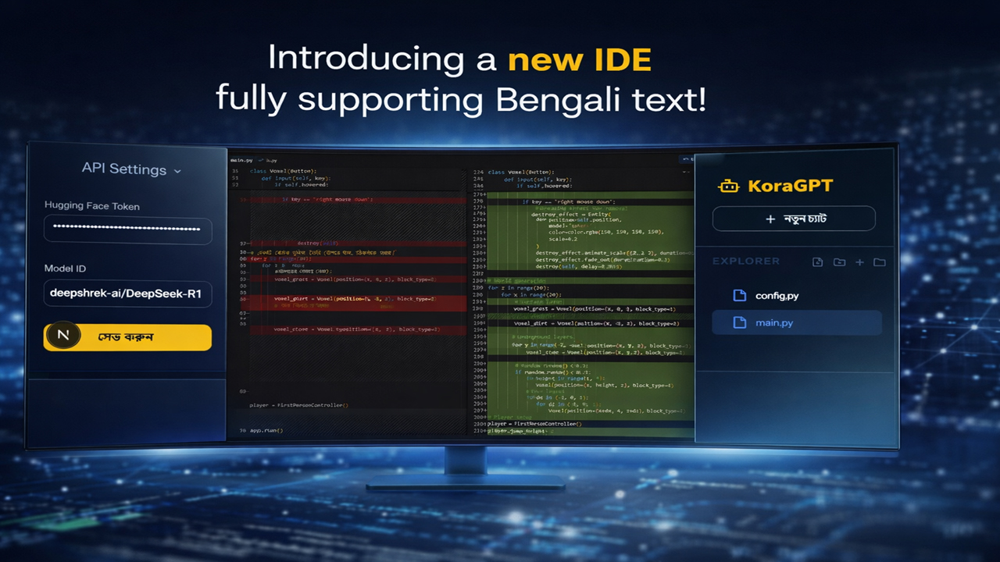

<div align="center">
  
  <h1>🚀 Kora AI - Premium Code Editor</h1>
  
  <p>
    <b>The Next-Generation, Open-Source Browser-Based AI Code Editor</b>
  </p>

  <p>
    🌐 <b>Live Preview:</b> <a href="https://koragpt.vercel.app/" target="_blank">https://koragpt.vercel.app/</a>
  </p>

  <!-- Badges -->
  <p>
    <a href="https://github.com/alornishan014/KoraGPT_IDE/blob/master/LICENSE">
      
    </a>
    <a href="https://github.com/alornishan014/KoraGPT_IDE/pulls">
      
    </a>
    
    
  </p>
</div>

<br />

## 🌟 What is Kora AI?

**Kora AI** is an advanced, AI-powered code editor that runs directly in your browser. Inspired by industry-leading editors like Cursor and Trae, Kora AI provides a premium, seamless development experience with deep AI integration. It understands your codebase, suggests complex edits, and applies them via an interactive, multi-tabbed Monaco Editor.

### 🛠️ How Kora AI Works (Architecture)
Kora AI is built using modern web technologies to provide a native-like IDE experience in the browser:
- **ChatSection**: The core AI interface where you can communicate with the AI. The AI understands your project context.
- **EditorSection**: Powered by Monaco Editor (the core of VS Code), offering robust code editing, syntax highlighting, and completion.
- **DiffView**: When the AI suggests changes, you can view them side-by-side with your original code, making it easy to accept or reject modifications.
- **ProjectTree**: A comprehensive file explorer that allows you to navigate through your project structure intuitively.
- **Sidebar & UI**: Built with Next.js and styled with modern CSS to ensure a sleek and responsive developer experience.

### ✨ Current Key Features

- **🤖 Deep AI Integration**: Chat directly with your codebase. The AI can read multiple files, understand context, and suggest precise code modifications.
- **📝 Monaco Editor Inside**: Powered by the same editor that runs VS Code, featuring syntax highlighting, code completion, minimap, and robust formatting.
- **🔄 Interactive Diff View**: See AI suggestions side-by-side with your original code. Accept (`Keep`) or Reject (`Undo`) changes with a single click.
- **📑 Multi-Tab Support**: Open, edit, and navigate through multiple files simultaneously with a sleek Tab Bar and Breadcrumbs.
- **🎙️ Voice-to-Code**: Speak your commands natively in Bengali or English, and let Kora AI write the code for you.
- **🎨 Image Generation**: Built-in support for generating images via Stable Diffusion.

---

## 🎯 Future Improvements (Areas for Contribution)

To make Kora AI the absolute best open-source AI editor, we are looking for contributors to help us build the following advanced features:

1. **💻 Integrated Terminal Emulation**: Allow users to run shell commands, install npm packages, and start dev servers directly inside Kora AI.
2. **🔌 Local LLM Support (Ollama)**: Enable developers to use offline, local AI models instead of relying on cloud APIs for privacy and cost savings.
3. **🐙 GitHub / GitLab Integration**: Directly authenticate, pull repositories, commit, and push changes from within the IDE.
4. **🌐 Real-Time Collaboration**: Multiplayer editing capabilities similar to Google Docs or VS Code Live Share.
5. **🛠️ Advanced LSP (Language Server Protocol) Support**: Better intellisense, error checking, and code navigation for Python, Rust, Go, and more.
6. **🎨 Advanced Theming Engine**: Allow users to create, import, and share custom editor themes.
7. **📂 Cloud Storage Sync**: Save workspaces to the cloud and access them from any device.

---

## 🤝 Why Contribute to Kora AI?

We believe the future of coding is collaborative and AI-driven. While Kora AI is built as a premium product, we are opening the doors to the community to make it the **absolute best open-source AI editor in the world**.

By contributing, you get to:
1. **Shape the Future**: Influence how developers write code in the browser.
2. **Work with Cutting-Edge Tech**: Gain hands-on experience with Next.js 16, Monaco Editor, Hugging Face Inference, and complex state management.
3. **Build Your Portfolio**: Be recognized as a core contributor to a premium open-source project.

Whether you're fixing a bug, adding a new feature, or improving documentation, **your code matters!**

👉 Please see our [CONTRIBUTING.md](./CONTRIBUTING.md) to get started!

---

## 🚀 Getting Started

### Prerequisites
- Node.js 18.x or later
- npm or yarn or pnpm
- Hugging Face API Token (for AI features)

### Installation

1. **Clone the repository:**
   ```bash
   git clone https://github.com/alornishan014/KoraGPT_IDE.git
   cd KoraGPT_IDE
   ```

2. **Install dependencies:**
   ```bash
   npm install
   ```

3. **Start the development server:**
   ```bash
   npm run dev
   ```

4. Open [http://localhost:3000](http://localhost:3000) in your browser.

### 🔑 API Settings Setup
To use the AI features, you need to configure your Hugging Face Token in the settings.
<div align="center">
  
</div>

---

## 🖼️ Adding Images to README (Example)
*Want to make your project's README visually appealing? You can easily add images!*

**Markdown Syntax:**
```markdown

```
**HTML Syntax (For better control over size/alignment):**
```html
<div align="center">
  
</div>
```
*(Tip: You can drag and drop images directly into the GitHub editor, or host them in your repository's `public/` folder and link to them like ``.)*

---

## 🛡️ License & Copyright

**Copyright © 2026 Kora AI. All rights reserved.**

This project is open-source, but it is **NOT** a free-for-all. It is protected under the **GNU Affero General Public License v3.0 (AGPL-3.0)**. 

### What does this mean?
- ✅ **You CAN** fork this repository, contribute, and run it locally.
- ✅ **You CAN** build features and submit Pull Requests.
- ❌ **You CANNOT** steal the code, change the name to your own, and launch it as a closed-source or commercial product without open-sourcing your entire platform.
- ❌ **You CANNOT** remove the copyright headers from the source files. The branding and identity of "Kora AI" must be respected.

We actively monitor for plagiarism. We love our contributors, but we will protect our intellectual property.

---

<div align="center">
  <b>Built with ❤️ by the Kora AI Team & Contributors</b>
</div>
